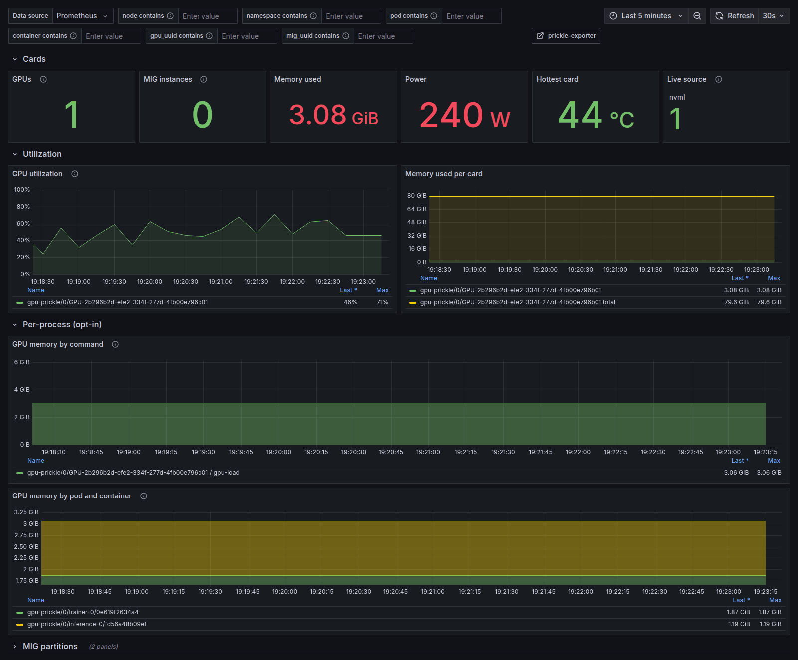

<p align="center">
  <picture>
    <source media="(prefers-color-scheme: dark)" srcset="assets/prickle-logo-dark.svg">
    
  </picture>
</p>

<p align="center">
  <em>A Prometheus exporter for host, container and GPU metrics.<br>
  One Go binary. Standard library only. Strictly read-only.</em>
</p>

<p align="center">
  <a href="https://github.com/starkdrift/prickle-exporter/actions/workflows/ci.yml"></a>
  
  
  
  
</p>

---

## Contents

- [What it is](#what-it-is)
- [Quick start](#quick-start)
- [Deploying](#deploying)
  - [systemd](#standalone-with-systemd)
  - Kubernetes
    - [Generic](#kubernetes-any-node) — starts on every node
    - [GPU nodes](#kubernetes-gpu-nodes) — a second, node-selected install
  - [container](#container-directly)
- [Try it: Prometheus and Grafana](#try-it-prometheus-and-grafana) — [Docker Compose](#with-docker-compose) · [Kubernetes](#on-kubernetes)
- [Pod names, and what they cost](#pod-names-and-what-they-cost)
- [Configuration](#configuration)
- [Documentation](#documentation)
- [Status](#status)
- [Contributing](#contributing)
- [License](#license)

## What it is

`prickle-exporter` builds one binary, `prickle`, that exposes Prometheus metrics
for a Linux host, the containers on it, and the GPUs in it — the three layers you
need together to answer "which tenant is using that accelerator, and is the node
underneath it healthy?"

It exists because that answer normally takes three exporters with three
different label conventions. `prickle` uses one closed set of identity labels
across all three layers, so a GPU series joins to a container series joins to a
node series without relabeling.

<p align="center">
  
</p>
<p align="center">
  <sub><em>GPU Tenancy, on a Kubernetes cluster — one <code>gpu_uuid</code>, split
  between two pods, with no relabeling.</em></sub>
</p>

Three properties are non-negotiable, and they are why the code looks the way it
does:

- **Zero third-party dependencies.** Including `prometheus/client_golang` — the
  text exposition is hand-written in [internal/exposition/](internal/exposition/)
  and gated on `promtool check metrics`. `go.sum` is empty and CI fails if it
  stops being empty.
- **Strictly read-only.** The exporter never writes to `/proc`, `/sys` or
  cgroups, and never calls an NVML function that mutates device state — no MIG
  reconfiguration, no clock or persistence-mode changes, no ECC toggles.
  Remediation belongs to something else.
- **A slow collector can never stall a scrape.** A sampler goroutine polls on an
  interval and swaps a fully rendered buffer under a mutex; `/metrics` serves the
  last completed render.

The full contract is [SPEC.md](SPEC.md). It is frozen: code follows the spec, and
changing a decision means editing SPEC.md first, in its own commit.

## Quick start

Requires Go 1.26. There is nothing to fetch — the module has no dependencies.

```sh
git clone https://github.com/starkdrift/prickle-exporter
cd prickle-exporter
CGO_ENABLED=0 go build -o prickle ./cmd/prickle
./prickle
```

Then scrape it:

```sh
curl -s localhost:10047/metrics | head
```

Port **10047** is fixed by [SPEC.md §Identity](SPEC.md#identity). `-web.listen-address`
exists for when something else on your workstation already holds it — don't
change it in anything that ships.

Stamp a version into the binary with:

```sh
go build -ldflags "-X main.version=$(git describe --tags --always)" -o prickle ./cmd/prickle
```

### Working from source

[scripts/dev-run.sh](scripts/dev-run.sh) wraps the common loops with
dev-friendly defaults — debug logging, a 2s sample interval, no root needed:

```sh
./scripts/dev-run.sh              # serve on :10047 until Ctrl-C
./scripts/dev-run.sh fixture      # same, but read a captured fixture tree
./scripts/dev-run.sh diagnose     # what this host can and cannot be read from
./scripts/dev-run.sh scrape       # start, scrape once, print, promtool, stop
```

See [scripts/README.md](scripts/README.md) for the details, including why
`fixture` mode still reports *your* filesystems.

## Deploying

Three ways, in rough order of how most people arrive at them. Full detail,
including the traps each one has, is in
[packaging/README.md](packaging/README.md).

### Standalone, with systemd

```sh
V=0.8.0
curl -fsSLO https://github.com/starkdrift/prickle-exporter/releases/download/v$V/prickle_v${V}_linux_amd64.tar.gz
curl -fsSLO https://github.com/starkdrift/prickle-exporter/releases/download/v$V/SHA256SUMS
grep prickle_v${V}_linux_amd64.tar.gz SHA256SUMS | sha256sum -c
tar xzf prickle_v${V}_linux_amd64.tar.gz

install -m 0755 prickle /usr/local/bin/prickle
install -m 0644 prickle.service /etc/systemd/system/
command -v restorecon >/dev/null && restorecon /etc/systemd/system/prickle.service
systemctl daemon-reload && systemctl enable --now prickle
```

The unit ships **inside the tarball**, so this needs nothing checked out. From a
git clone it is `packaging/systemd/prickle.service` instead; the file is the
same one.

The unit runs under `DynamicUser` with `ProtectSystem=strict`, an empty
capability set and a syscall allow-list — verified on live hosts as `CapEff
0000000000000000`, and rated 1.5 by `systemd-analyze security`.

On NVIDIA hosts take the `prickle-nvml` tarball instead — it ships
`prickle-nvml.service`, hardened identically but for the device access NVML
needs. **Do not skip the
`restorecon` line**: on an SELinux host a unit file with the wrong label is
invisible to systemd, which then reports `Unit prickle.service not found` for a
file that is plainly there.

### Kubernetes, any node

```sh
helm install prickle packaging/helm/prickle-exporter -n monitoring --create-namespace \
  --set collectors.podNames.enabled=true
```

A DaemonSet, a headless Service, and an optional ServiceMonitor. **No
ServiceAccount and no RBAC** — the exporter reads the node's filesystem and
never the Kubernetes API, so there is nothing for a token to be for.

That runs on **every node in any cluster**, GPU or not: it mounts nothing from
the host beyond `/proc` and `/sys`, so there is no node it can fail to start on.

Three optional flags, all off by default. The command above sets the first;
the other two are left out of it because each needs something of the cluster
that not every cluster has, and `helm install` fails rather than degrades:

| Flag | What it buys | What it costs |
|---|---|---|
| `collectors.podNames.enabled` | `pod_name="checkout-7d9f"` instead of only `pod="537209ed-…"`, plus a populated `namespace` | runs the pod in group root (`runAsGroup: 0`) to read `/var/log/pods` — [read this first](#pod-names-and-what-they-cost) |
| `serviceMonitor.enabled` | Prometheus Operator discovers the DaemonSet on its own | **Requires the Prometheus Operator's CRD.** Without it `helm install` fails outright rather than degrading — deliberately, since a silently-ignored ServiceMonitor is a cluster that looks monitored and is not. Scrape with a static config or pod discovery instead |
| `nvml.enabled` | NVIDIA GPU metrics | Requires a driver on the node — [see below](#kubernetes-gpu-nodes) |

Drop `collectors.podNames.enabled` too and the install is still valid — plain
`helm install prickle packaging/helm/prickle-exporter -n monitoring
--create-namespace` gives you every host and container metric, unprivileged,
with pods identified by UID.

Verified on a kubeadm cluster at 0.7.0: 220 series, 24 containers, every pod
name resolved, all three QoS classes.

### Kubernetes, GPU nodes

The static image carries **no GPU support at all** — it is `FROM scratch` with
one binary, so its `nvidia-smi` fallback has nothing to exec and `prickle
diagnose` reports `live source: none`. GPU metrics mean a second install, onto
the GPU nodes only:

```sh
helm install prickle-gpu packaging/helm/prickle-exporter -n monitoring \
  --set collectors.podNames.enabled=true \
  --set serviceMonitor.enabled=true \
  --set nvml.enabled=true \
  --set-string nodeSelector."nvidia\.com/gpu\.present"=true
```

`nvml.enabled` pulls the separate `-nvml` image and `hostPath`-mounts the
driver's `libnvidia-ml.so.1` and device nodes, which it `dlopen`s for per-GPU
utilisation, memory, temperature, power and MIG.

The `nodeSelector` is not optional. The DaemonSet tolerates every taint by
design, so without it this lands on CPU nodes too and sticks in
**`ContainerCreating`** forever — not `CrashLoopBackOff`, so `kubectl logs`
shows nothing and only `kubectl describe` names the missing driver file. Use
whatever label marks your GPU nodes; the one above is the NVIDIA device
plugin's — and note `--set-string`, because plain `--set` types `true` as a
boolean and the API rejects the DaemonSet (`cannot unmarshal bool … of type
string`). `helm template` renders it without complaint, so that one only shows
up on apply. RHEL-family nodes need `nvml.libraryPath=/usr/lib64/…`, and a node
with more than one GPU needs an `nvml.devices` entry per card.

Images are published to `ghcr.io/starkdrift/prickle-exporter` as
multi-architecture manifest lists, so an air-gapped registry can mirror them
with `skopeo copy --all`.

### Container, directly

```sh
docker run -d --name prickle --network=host \
  -v /proc:/host/proc:ro -v /sys:/host/sys:ro \
  ghcr.io/starkdrift/prickle-exporter:0.8.0 -path.rootfs=/host
```

`-path.rootfs=/host` is not optional — without it the exporter faithfully
reports the metrics of its own container.

## Try it: Prometheus and Grafana

### With Docker Compose

```sh
cd packaging/compose && docker compose up -d
```

Brings up prickle, Prometheus, and a Grafana with the datasource and all four
dashboards already provisioned — **GPU Tenancy**, **Node Overview**,
**Container Resources** and **Fleet Health**.

- Grafana <http://localhost:3000> — anonymous admin, no login
- Prometheus <http://localhost:9090>
- Raw metrics <http://localhost:10047/metrics>

Each dashboard carries a `contains` textbox for every identity label and no
dropdowns: type a fragment, press enter, and the panels filter to substring
matches. The boxes combine, so `namespace contains kube` and `container
contains api` narrow to both.

It is a demonstration, not a deployment — Grafana runs with anonymous admin so
there is no password step. Do not put it on a network you do not own.

### On Kubernetes

The same four dashboards on a cluster — prickle as a DaemonSet, Prometheus
finding it by pod discovery, and Grafana with everything provisioned:

```sh
helm install prickle packaging/helm/prickle-exporter -n prickle-demo --create-namespace \
  --set collectors.podNames.enabled=true
kubectl apply -f packaging/kubernetes-demo/
kubectl -n prickle-demo port-forward svc/grafana 3000:3000
```

That single release covers a uniform cluster. **A cluster where only some nodes
have a GPU needs two**, because the stock image carries no GPU support and the
NVML image cannot start on a node without a driver — the split, and the rest of
the detail, is in
[packaging/kubernetes-demo/README.md](packaging/kubernetes-demo/README.md).

## Pod names, and what they cost

By default a container in a pod is identified by the pod's **UID**, not its
name:

```
prickle_container_info{pod="537209ed-f2d7-423a-8e0a-ec05d6280092", pod_name="", ...}
```

That is not a limitation of the exporter so much as of where it looks. The
cgroup tree carries a pod's UID and never its name — the kernel only ever sees
the UID. Most people want the name, and `-collector.container.pod-names` gets
it:

```
prickle_container_info{pod="537209ed-…", pod_name="web-frontend", namespace="default", ...}
```

It works by listing `/var/log/pods/<namespace>_<pod>_<uid>/`, which the
**kubelet** creates on every CRI runtime. One directory listing, no API call,
no second exporter, and nothing inside those directories is read — the names
*are* the directory names, so workload log content is never opened.

**The cost, stated plainly — and it differs by how you run it.**
`/var/log/pods` is `root:root 0750`, so something has to satisfy that mode.

On **Kubernetes** the chart runs the pod as uid 65532 with `runAsGroup: 0`, and
the directory's *group* bits are the entire grant. It costs group-root
membership: the exporter can read files that are group-readable and owned by
group root, and nothing else. It adds **no capability**, because a capability
added to a non-root uid is unusable — Kubernetes puts it in the bounding set
only, leaving `CapPrm`, `CapEff` and `CapAmb` all zero. The chart asked for
`CAP_DAC_READ_SEARCH` until 0.8.0 and never once used it.

On **systemd** the drop-in below sets `AmbientCapabilities=CAP_DAC_READ_SEARCH`,
which does work — systemd sets the ambient set, so the non-root `DynamicUser`
really holds the capability. That is the more expensive of the two: it bypasses
file-read and directory-search checks **everywhere on the host**, and in the
same test that proved it reads `/var/log/pods` it also read `/etc/shadow`.

So the decision is genuinely yours, and it is not obvious:

| | Default | `pod-names` on Kubernetes | `pod-names` under systemd |
|---|---|---|---|
| Pod identified by | UID | name and namespace | name and namespace |
| Capabilities | none | none | `CAP_DAC_READ_SEARCH` |
| Extra reach | none | files readable by group root | **any file on the host** |
| Container metrics | all of them | all of them | all of them |

Both routes assume `/var/log/pods` is `0750` with group root, which is what
these hosts ship. A node that ships it `0700` leaves running as uid 0 as the
only way, and on such a node the group-root route silently yields no names.

**Nothing else changes.** Every container is reported either way, with every
metric; only the labels differ. If you leave it off and later want names in
dashboards, a join against `kube_pod_info` from kube-state-metrics gets you
there without granting anything.

Enabling it:

```sh
# Kubernetes
helm install prickle packaging/helm/prickle-exporter -n monitoring \
  --set collectors.podNames.enabled=true

# systemd — a drop-in, so the shipped unit stays unprivileged
systemctl edit prickle
#   [Service]
#   ExecStart=
#   ExecStart=/usr/local/bin/prickle -collector.container.pod-names
#   AmbientCapabilities=CAP_DAC_READ_SEARCH
#   CapabilityBoundingSet=CAP_DAC_READ_SEARCH
```

If you enable it without granting the privilege, nothing breaks: the exporter
logs `open /var/log/pods: permission denied` once per pass, reports every
container as usual, and leaves `pod_name` empty.

## Configuration

All flags, with defaults:

| Flag | Default | Notes |
|---|---|---|
| `-web.listen-address` | `:10047` | Port fixed by SPEC §Identity. |
| `-web.telemetry-path` | `/metrics` | |
| `-sample.interval` | `10s` | How often collectors are polled. Scrapes are served from the last completed pass. |
| `-collector.timeout` | `5s` | Deadline for one collector's pass. |
| `-node` | system hostname | The `node` identity label. **Set this explicitly on Kubernetes** — a pod's view of the hostname is not the node's name. |
| `-path.rootfs` | — | Prefix `/proc`, `/sys` and the cgroup mount with this directory. For fixture trees, or for running in a container with the host filesystem bind-mounted. Wins over the three flags below. |
| `-path.procfs` | `/proc` | |
| `-path.sysfs` | `/sys` | |
| `-path.cgroupfs` | `/sys/fs/cgroup` | cgroup v2 mount point. |
| `-collector.cpu.per-core` | `false` | Opt-in. Costs one series per core per mode — deliberately off so default cardinality doesn't scale with core count on a large GPU node. Exposed as a separate family from the aggregate, which is always on. |
| `-collector.diskstats.ignored-devices` | `^(ram\|loop\|fd\|sr)\d+$` | Regexp. |
| `-collector.netdev.ignored-devices` | *(none)* | Regexp. `^veth` is the usual choice on a Kubernetes node. |
| `-collector.filesystem.excluded-fs-types` | pseudo-filesystems, `overlay`, `squashfs` | Regexp. |
| `-collector.filesystem.excluded-mount-points` | `/dev`, `/proc`, `/sys`, per-container and per-pod mounts | Regexp. |
| `-collector.container` | `true` | Walk the cgroup v2 tree. Set false on a host where you only want node metrics. |
| `-collector.container.docker-socket` | *(none)* | Path to the Docker socket, usually `/var/run/docker.sock`. Enables one GET request per pass for container names and images, which land on `prickle_container_info` and never on a hot series. Empty — the default — opens no socket at all. |
| `-collector.container.docker-timeout` | `2s` | Deadline for that request. A wedged daemon costs the names, not the metrics. |
| `-collector.gpu` | `true` | Expose GPU metrics. NVIDIA only today. |
| `-collector.gpu.nvidia-source` | `auto` | `auto`, `nvml` or `smi`. `auto` tries NVML and falls back to `nvidia-smi`. A debugging flag, not a tuning knob. |
| `-collector.gpu.per-process` | `false` | Also expose per-process GPU memory, keyed on `command` from the executable's basename — never a PID. Opt-in: one series per distinct command per GPU. |
| `-collector.gpu.nvidia-smi-command` | `nvidia-smi` | The binary to spawn, for hosts that keep it outside PATH. |
| `-log.level` | `info` | `debug`, `info`, `warn`, `error`. |
| `-version` | | Print version and exit. |

Regexps are compiled at startup, so a typo fails immediately rather than at the
first scrape.

## Documentation

| | |
|---|---|
| [docs/metrics.md](docs/metrics.md) | Every metric family, and `prickle diagnose` |
| [packaging/README.md](packaging/README.md) | systemd, images, Helm, dashboards, CI trust model |
| [docs/verification.md](docs/verification.md) | Where this has been run and what it found |
| [docs/development.md](docs/development.md) | Building, testing, releasing |
| [SPEC.md](SPEC.md) | The frozen contract — every decision and its reason |
| [CHANGELOG.md](CHANGELOG.md) | What changed per release, and what to do about it |

## Status

**Phase 5 — all five roadmap phases are implemented.** Host, container and
NVIDIA GPU collectors, each developed against captured fixture trees;
per-collector timeouts, cardinality caps and self-instrumentation; and the
distribution artifacts — two binaries with hardened systemd units,
multi-architecture container images, a Helm chart, a compose quickstart and
four Grafana dashboards.

The container collector reads **both cgroup hierarchies**, both cgroup drivers,
and four runtimes: Docker, containerd (through the CRI and through nerdctl),
CRI-O and podman.

The GPU collector reads **NVIDIA and AMD**. Both gaps that stood here closed
together on 2026-08-04, on one host: AMD is captured, implemented and verified
live against 2× MI300X, which is also the first multi-GPU machine this exporter
has read. Intel is out of scope (SPEC §Collectors).

What is unexercised is narrower now. Those cards are SR-IOV virtual functions,
so AMD's compute partitioning has only ever been seen fixed at `SPX` by a
hypervisor, and no host with **both** vendors' cards in it has been scraped.

This is `0.8.x`, deliberately not `1.0`: that freezes the metrics contract, and
the contract is still moving.

| Phase | Scope | State |
|---|---|---|
| 1 | Host — CPU, memory, disks, network, load, PSI, filesystems | **shipped** |
| 2 | Containers — cgroup v2 and v1, Docker/containerd/CRI-O/podman/Kubernetes | **shipped** |
| 3 | GPU — NVIDIA (NVML + `nvidia-smi`), AMD sysfs + DRM fdinfo | **shipped**; Intel out of scope |
| 4 | Per-collector timeouts, cardinality caps, self-instrumentation | **shipped** |
| 5 | Distribution — systemd, images, Helm, dashboards | **shipped** |

Linux only. Where it has been run, and what that found, is in
[docs/verification.md](docs/verification.md).

## Contributing

This repository is public so it can be audited and so problems can be reported —
not so patches can be merged. **Pull requests are closed automatically**, good
ones included; issues are the route that works, and bug reports and feature
discussion through them are genuinely welcome. The reasoning, and how to report
a vulnerability privately, are in
[.github/CONTRIBUTING.md](.github/CONTRIBUTING.md).

## License

Apache-2.0 — see [LICENSE](LICENSE). Every source file carries an
`SPDX-License-Identifier: Apache-2.0` header, and CI enforces it.

---

<p align="center">
  <picture>
    <source media="(prefers-color-scheme: dark)" srcset="assets/prickle-mark-dark.svg">
    
  </picture>
  <br>
  <sub>A <a href="https://github.com/starkdrift">Starkdrift</a> project.</sub>
</p>
